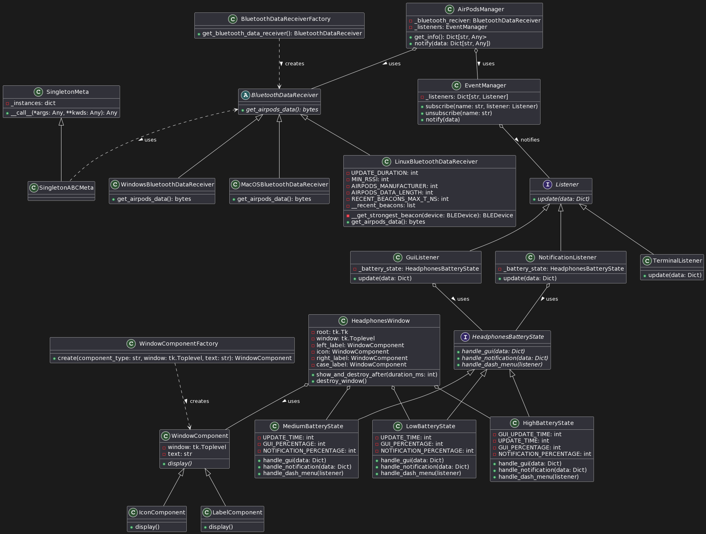

# AirPods Battery Manager

This project is a comprehensive solution for managing and displaying the battery status of AirPods across different platforms. It is implemented using Python and leverages several design patterns to ensure a clean, maintainable, and scalable codebase.

## Technology

The project is built with Python, a powerful and flexible programming language that allows for cross-platform compatibility. It uses the Tkinter library for creating graphical user interfaces, and the PyBluez library for Bluetooth communication.

## Design Patterns

The project uses the following design patterns:

### Observer Pattern

The Observer pattern is used to implement a subscription mechanism to notify multiple objects about any events that happen to the object they’re observing. In this project, the `EventManager` class acts as the subject, while the `GuiListener`, `NotificationListener`, and `TerminalListener` classes act as observers. Whenever the state of the AirPods changes, all registered listeners are notified.

### Factory Pattern

The Factory pattern is used to create objects without specifying the exact class of object that will be created. In this project, the `WindowComponentFactory` class is used to create different types of window components (`IconComponent` and `LabelComponent`) without specifying the exact class of the component that will be created.

### State Pattern

The State pattern is used to alter an object's behavior when its state changes. In this project, the `HeadphonesBatteryState` class and its subclasses (`LowBatteryState`, `MediumBatteryState`, `HighBatteryState`) are used to handle different battery states. The behavior of the `GuiListener` and `NotificationListener` classes changes depending on the current battery state.

### Abstract Factory Pattern

The Abstract Factory pattern provides an interface for creating families of related or dependent objects without specifying their concrete classes. This pattern is particularly useful when the system needs to be independent from the way its objects are created, composed, and represented.

In this project, the Abstract Factory pattern is used to create platform-dependent `BluetoothDataReceiver` objects. The abstract factory, represented by an interface or an abstract class, declares a set of methods that return different abstract products. These products are then implemented in separate concrete factories.

Here's how it's used in the context of this project:

- An abstract factory `BluetoothDataReceiverFactory` is defined. This factory has a method `createBluetoothDataReceiver()`, which returns an object of type `BluetoothDataReceiver`.

- Concrete factories like `WindowsBluetoothDataReceiverFactory`, `MacBluetoothDataReceiverFactory`, and `LinuxBluetoothDataReceiverFactory` are implemented. Each of these factories override the `createBluetoothDataReceiver()` method to return a `BluetoothDataReceiver` that is specific to a particular platform.

- The `BluetoothDataReceiver` is an abstract product with a method `get_airpods_data()`. This method is implemented differently in each platform-specific subclass (`WindowsBluetoothDataReceiver`, `MacBluetoothDataReceiver`, `LinuxBluetoothDataReceiver`) to handle the platform-specific details of receiving data from the AirPods via Bluetooth.

This way, the `AirPodsManager` class can remain platform-independent. It simply asks the factory for a `BluetoothDataReceiver`, and uses it to get the AirPods data, without needing to know any of the platform-specific details. The correct factory can be chosen at runtime based on the platform the software is running on.

## UML Diagram

A UML diagram representing the structure of the project



## Installation

Use ```python 3.12``` to run without any issues.

```bash
pip install -r requirements.txt
```

## Usage

```bash
python main.py time_in_seconds gui_policy notification_policy
```

Example:

```bash
python main.py 15 low medium
```
